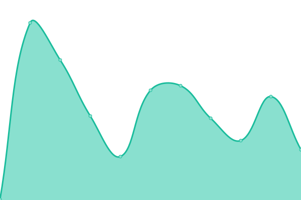
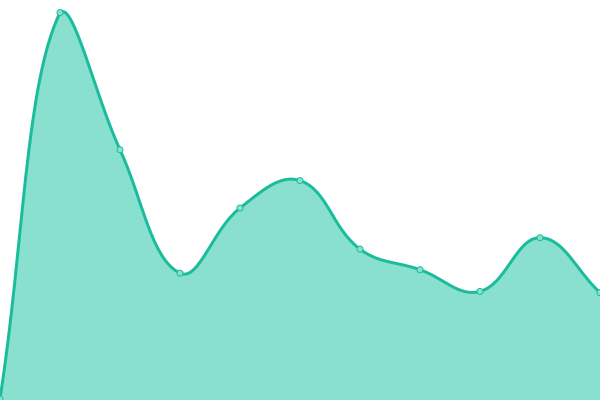

# [📈 Live Status](https://ragnarok22.github.io/upptime): <!--live status--> **🟧 Partial outage**

This repository contains the open-source uptime monitor and status page for [Reinier Hernández](https://blog.ragnarok22.dev), powered by [Upptime](https://github.com/upptime/upptime).

With [Upptime](https://upptime.js.org), you can get your own unlimited and free uptime monitor and status page, powered entirely by a GitHub repository. We use [Issues](https://github.com/ragnarok22/upptime/issues) as incident reports, [Actions](https://github.com/ragnarok22/upptime/actions) as uptime monitors, and [Pages](https://ragnarok22.github.io/upptime) for the status page.

<!--start: status pages-->
<!-- This summary is generated by Upptime (https://github.com/upptime/upptime) -->
<!-- Do not edit this manually, your changes will be overwritten -->
<!-- prettier-ignore -->
| URL | Status | History | Response Time | Uptime |
| --- | ------ | ------- | ------------- | ------ |
|  [Personal Web](https://reinierhernandez.com) | 🟩 Up | [personal-web.yml](https://github.com/ragnarok22/upptime/commits/HEAD/history/personal-web.yml) | 

 556ms
     
 | 

<a href="https://upptime.ragnarok22.dev/history/personal-web">100.00%</a>
    

|  [Suri App](https://suriapp.sr) | 🟥 Down | [suri-app.yml](https://github.com/ragnarok22/upptime/commits/HEAD/history/suri-app.yml) | 

 2200ms
     
 | 

<a href="https://upptime.ragnarok22.dev/history/suri-app">97.08%</a>
    

|  [NVIM Store](https://nvim.store) | 🟩 Up | [nvim-store.yml](https://github.com/ragnarok22/upptime/commits/HEAD/history/nvim-store.yml) | 

 359ms
     
 | 

<a href="https://upptime.ragnarok22.dev/history/nvim-store">100.00%</a>
    

|  [Whatsapp Redirect](https://whatsapp.ragnarok22.dev) | 🟩 Up | [whatsapp-redirect.yml](https://github.com/ragnarok22/upptime/commits/HEAD/history/whatsapp-redirect.yml) | 

 431ms
     
 | 

<a href="https://upptime.ragnarok22.dev/history/whatsapp-redirect">100.00%</a>
    

|  [Suri Rate](https://suri-rate.ragnarok22.dev) | 🟩 Up | [suri-rate.yml](https://github.com/ragnarok22/upptime/commits/HEAD/history/suri-rate.yml) | 

 403ms
     
 | 

<a href="https://upptime.ragnarok22.dev/history/suri-rate">100.00%</a>
    

|  [Device Size](https://device-size.ragnarok22.dev) | 🟩 Up | [device-size.yml](https://github.com/ragnarok22/upptime/commits/HEAD/history/device-size.yml) | 

 312ms
     
 | 

<a href="https://upptime.ragnarok22.dev/history/device-size">100.00%</a>
    

|  [Gamers mancos](https://gamersmancos.lol) | 🟩 Up | [gamers-mancos.yml](https://github.com/ragnarok22/upptime/commits/HEAD/history/gamers-mancos.yml) | 

 236ms
     
 | 

<a href="https://upptime.ragnarok22.dev/history/gamers-mancos">100.00%</a>
    

|  [Old Personal Web](https://ragnarok22.dev) | 🟩 Up | [old-personal-web.yml](https://github.com/ragnarok22/upptime/commits/HEAD/history/old-personal-web.yml) | 

 224ms
     
 | 

<a href="https://upptime.ragnarok22.dev/history/old-personal-web">100.00%</a>
    

<!--end: status pages-->

[**Visit our status website →**](https://ragnarok22.github.io/upptime)

## 📄 License

- Powered by: [Upptime](https://github.com/upptime/upptime)
- Code: [MIT](./LICENSE) © [Reinier Hernández](https://blog.ragnarok22.dev)
- Data in the `./history` directory: [Open Database License](https://opendatacommons.org/licenses/odbl/1-0/)
